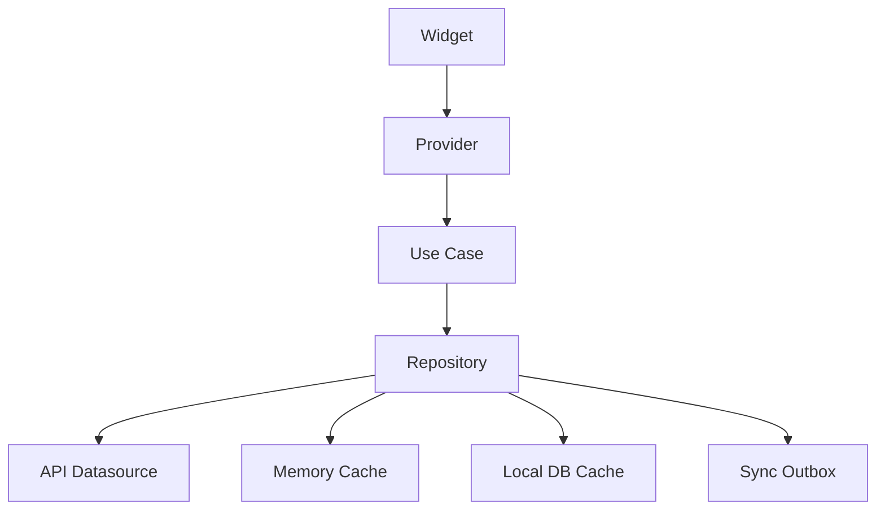

<!-- title: Flutter API Integration -->
<!-- status: Active -->
<!-- system: TM-EPOS MVP -->
<!-- last_updated: 2026-06-29 -->

# Flutter API Integration

## Purpose

This file defines how Flutter integrates with backend APIs.

The backend is the final authority.
Flutter repositories decide whether to use API, memory cache, local DB, or
offline outbox based on operation safety.

## API Integration Flow

## API Groups Used By Flutter

| API Group | Flutter Usage |
|---|---|
| `/auth` | Login, refresh, logout, context |
| `/tenant-admin` | Admin setup and permission context |
| `/pos` | Sale, till, receipt, cash, device |
| `/orders` | Unified order list/detail/status |
| `/fulfilment-pickup` | Pickup and fulfilment staff flows |
| `/payments-refunds` | Payment/refund flows |
| `/returns-exchanges` | Return and exchange flows |
| `/offline-sync` | Offline client, sync batches, conflicts |
| `/reports` | Operational reports |

## Online Store Boundary

Customer storefront browsing and checkout are web/customer-facing.

Flutter may handle staff-side online order list, pickup preparation, and
fulfilment status.

## Repository Rule

Repositories must expose domain-friendly methods, not raw HTTP responses.

## DTO Rule

Use API DTOs in data layer only.
Map DTOs to domain/view models before UI.

## Final Validation Rule

Before completing protected actions, Flutter must call backend validation.

Protected actions include final sale total, payment, refund, exchange, loyalty,
store credit, final stock, and till close.

## Related Files

- [[Flutter_API_Network]]
- [[Flutter_DTO_And_Mapping_Rules]]
- [[Flutter_Order_ClickCollect_Fulfilment]]
