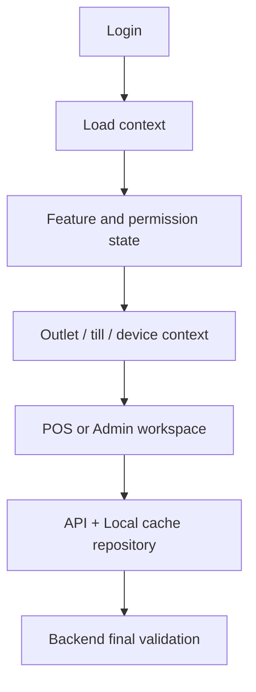

<!-- title: Flutter App Architecture -->
<!-- status: Active -->
<!-- system: TM-EPOS MVP -->
<!-- last_updated: 2026-06-29 -->


# Flutter App Architecture

## Purpose

This file defines the Flutter application architecture for TM-EPOS MVP.

Flutter is used for POS, tenant/business admin, device operation, fulfilment and
pickup staff workflows, and offline-capable selling flows.

The customer online store is browser/web-facing and is not treated as the Flutter
POS UI, but Flutter may show online orders and click-and-collect fulfilment
workflows for staff.

## Architecture Decision

Use feature-based clean architecture with Riverpod state management, GoRouter
routing, Dio networking, local persistent cache, memory cache, and repository
abstractions.

Widgets must not call APIs directly.

## Layer Rule

```text
Presentation -> Application/State -> Domain -> Data -> API / Local Cache
```

## Flutter Responsibilities

| Area | Flutter Responsibility |
|---|---|
| POS | Fast sale, cart, payment, receipt, hold/recall |
| Tenant Admin | Products, inventory, outlets, tills, users, roles, reports |
| Offline | Local cache, offline queue, sync status, pending actions |
| Device | Printer, scanner, drawer, payment device interaction |
| Pickup | Online order fulfilment and pickup staff workflow |
| Reports | Operational summaries where API provides data |

## Backend Final Authority

Flutter may cache and calculate for fast UI, but backend validates final sale
total, payment, refund, exchange, inventory, loyalty/store credit, till close,
and sync acceptance.

## Main App Flow



## Feature Boundary

Flutter must not show excluded MVP areas such as kiosk, delivery management,
supplier management, advanced coupons, AI modules, or full accounting.

## Related Files

- [[Flutter_Folder_Structure]]
- [[Flutter_API_Integration]]
- [[Flutter_Offline_Operation_Sync]]
- [[Flutter_Virtual_Caching_Strategy]]
