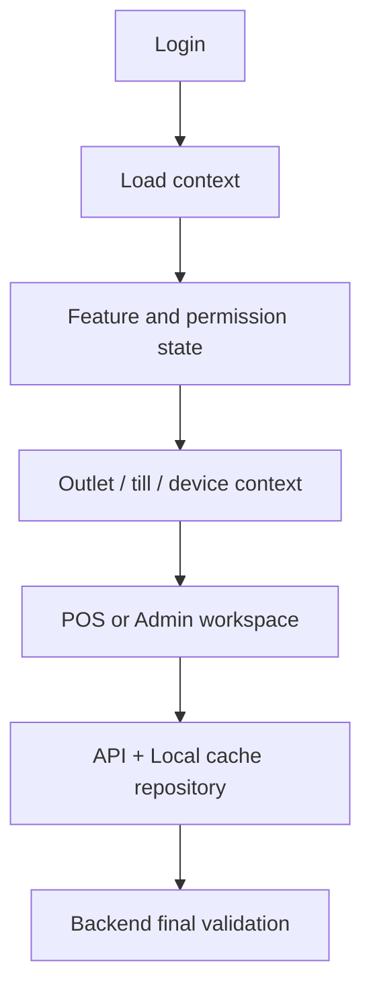

<!-- title: Flutter App Architecture -->
<!-- status: Active -->
<!-- system: OneVerz POS MVP -->
<!-- last_updated: 2026-08-08 -->


# Flutter App Architecture

## Purpose

This file defines the Flutter application architecture for OneVerz POS MVP.

Flutter is used for POS, tenant/business admin, device operation, fulfilment and
pickup staff workflows, and offline-capable selling flows.

The customer online store is browser/web-facing and is not treated as the Flutter
POS UI, but Flutter may show online orders and click-and-collect fulfilment
workflows for staff.

## Architecture Decision

Use feature-first clean architecture with Riverpod state management, GoRouter
routing, Dio networking, local persistent cache, secure storage outbox, and repository
abstractions.

Widgets must not call APIs directly.

## Layer and Dependency Flow

```text
Widget / Screen
       ↓
Presentation Provider
       ↓
Domain Use Case
       ↓
Domain Repository Contract
       ↓
Data Repository Implementation
       ↓
 ┌─────────────────────┐
 │                     │
Remote Datasource   Local Datasource
 │                     │
Backend API         Cache / Outbox /
                    Recovery Storage
```

### Architectural Rules

1. **Feature-First Organization**: Features (e.g. `features/discount/`, `features/pos/`) contain their own `data`, `domain`, and `presentation` layers.
2. **Single Feature Rule**: Features that support both online and offline modes (such as Discount) remain ONE single frontend feature. Online and offline are data-access strategies under `data/datasources/remote/` and `data/datasources/local/`, never separate features (`features/online_discount`, `features/offline_discount` or `discount/online/`, `discount/offline/` are prohibited).
3. **Presentation Layer**: Exposes UI state and orchestrates use case invocations. Providers must not contain raw API communication or outbox serialization logic.
4. **Domain Layer**: Contains business models (entities), abstract repository contracts, and isolated use cases. The domain layer must never depend on Flutter presentation widgets.
5. **Data Layer**: Implements repository contracts by coordinating between remote HTTP data sources and local caching/outbox/recovery stores.

## Flutter Responsibilities

| Area | Flutter Responsibility |
|---|---|
| POS | Fast sale, cart, payment, receipt, hold/recall |
| Tenant Admin | Products, inventory, outlets, tills, users, roles, reports |
| Offline | Local cache, offline queue, sync status, pending actions |
| Device | Printer, scanner, drawer, payment device interaction |
| Pickup | Online order fulfilment and pickup staff workflow |
| Reports | Operational summaries where API provides data |

## Backend Final Authority

Flutter may cache and calculate for fast UI, but backend validates final sale
total, payment, refund, exchange, inventory, future/deferred loyalty or store credit, till close,
and sync acceptance.

## Main App Flow


```mermaid
flowchart TD
    A[Login] --> B[Load context]
    B --> C[Feature and permission state]
    C --> D[Outlet / till / device context]
    D --> E[POS or Admin workspace]
    E --> F[API + Local cache repository]
    F --> G[Backend final validation]
```

## Feature Boundary

Flutter must not show excluded MVP areas such as kiosk, delivery management,
supplier management, advanced coupons, AI modules, or full accounting.

## Related Files

- [[Flutter_Folder_Structure]]
- [[Flutter_API_Integration]]
- [[Flutter_Offline_Operation_Sync]]
- [[Flutter_Virtual_Caching_Strategy]]
