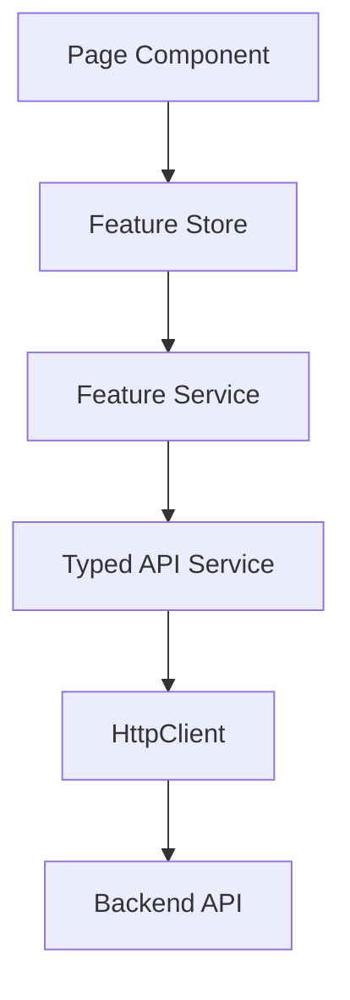

<!-- title: Angular API Integration Guide -->
<!-- status: Active -->
<!-- system: SCS-TIX EPOS Release 1 -->
<!-- last_updated: 2026-06-18 -->

# Angular API Integration Guide

## Purpose

This file defines API integration rules for the Angular Platform Admin Web Portal.

Angular must call real backend APIs and use real database-backed responses in the
final release output.

## API Layering

## API Service Rule

Page components must not build raw API URLs.

Shared UI components must not call API services.

Typed API services should map request/response models only.

Feature stores/services may orchestrate frontend workflow state.

## Core API Services

`core/services` may include:

- Auth service.
- Tenant context service.
- Permission service.
- Feature entitlement service.
- API error mapper.
- Session handling service.

Feature-specific API services stay inside feature folders.

## Interceptor Rules

Interceptors may attach auth token, selected tenant context only for tenant-scoped
APIs, correlation/trace ID where used, and handle global 401/403/500 behavior.

Do not attach tenant context to platform-only APIs.

## Tenant Context Rule

Tenant-scoped APIs require selected tenant context.

Platform-level APIs must not receive stale selected tenant context unless the API
is explicitly managing a selected tenant.

## API Groups Used by Angular

| Angular Feature | Backend API Area |
|---|---|
| Auth | `/api/v1/auth` |
| Admin tenant setup | `/api/v1/tenants`, `/api/v1/platform` |
| Subscription plans | `/api/v1/platform/subscription-plans` |
| Entitlement | `/api/v1/features` |
| Platform permission catalog | `/api/v1/platform-admin/permission-catalog`, `/api/v1/platform-admin/permission-catalog/flat` |
| Platform roles and permissions | `/api/v1/platform-admin/roles`, `/api/v1/platform-admin/roles/{roleId}`, `/api/v1/platform-admin/roles/{roleId}/permissions` |
| Tenant users/roles/permissions | `/api/v1/users`, tenant-admin role permission APIs |
| Outlets/tills | `/api/v1/outlets`, `/api/v1/tills` |
| Products/categories | `/api/v1/products`, `/api/v1/categories` |
| Reports | `/api/v1/reports` |

## Error Handling

API errors should map to field validation, form-level errors, permission denied,
feature not enabled, tenant context missing, and server error states.

Do not expose raw backend exception details.

## Pagination Rule

Use backend pagination, filtering, and sorting for tenants, users, products,
categories, reports, outlets, tills, and audit logs.

## Cache Rule

Cache only safe small reference data.

Clear tenant-scoped cache when selected tenant changes.

## Related Files

- [[Angular_App_Architecture]]
- [[Tenant_Wizard_State]]
- [[Routing_And_Guards]]
- [[Angular_Environment_Config]]
- [[../05_BACKEND_ARCHITECTURE/API_Standards]]

## Platform Role Management API Rule

Angular Platform Admin role-management screens must use the backend role APIs:

- `GET /api/v1/platform-admin/permission-catalog`
- `GET /api/v1/platform-admin/permission-catalog/flat` (`data.items`)
- `GET /api/v1/platform-admin/roles`
- `POST /api/v1/platform-admin/roles`
- `GET /api/v1/platform-admin/roles/{roleId}`
- `PUT /api/v1/platform-admin/roles/{roleId}`
- `GET /api/v1/platform-admin/roles/{roleId}/permissions`
- `PUT /api/v1/platform-admin/roles/{roleId}/permissions`

Roles, assigned permission counts, permission codes, and save results must come from these APIs. Do not create fake roles or duplicate the permission catalog tree in Angular.

## Platform Roles & Permissions UI Service 2026-06-23

Angular added a typed `PlatformRoleManagementApiService` and `platform-role-management.model.ts` for the Platform Admin role editor. Page components must use this service instead of building raw URLs.

The page fetches the backend permission catalog through `PlatformPermissionCatalogApiService` and fetches role list/detail/assignments through `PlatformRoleManagementApiService`. Save uses backend responses only and reloads roles/detail/assignments after success.

Unit coverage added for service endpoints and page behavior: two-panel render with no permanent right summary panel, role selection/detail fill, assigned permissions checked, compact summary counts, search/module/scope/action filters, Read Only/Full Access modes, dirty banner, Preview Impact modal, reset, edit save, create save, and API error state.
