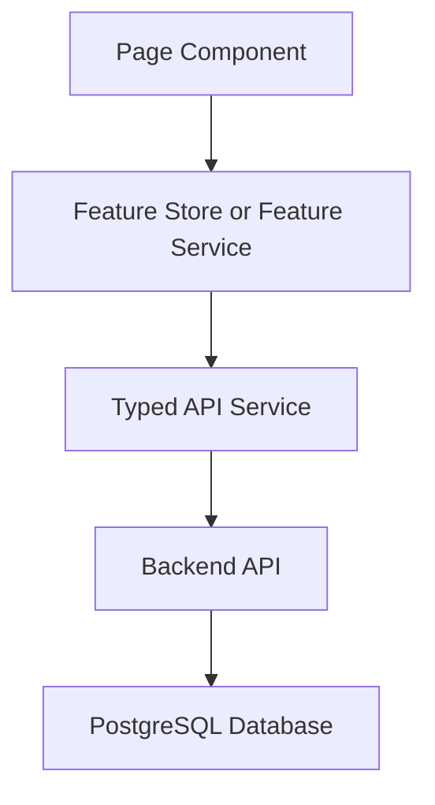

<!-- title: Angular App Architecture -->
<!-- status: Active -->
<!-- system: SCS-TIX EPOS Release 1 -->
<!-- last_updated: 2026-06-08 -->


# Angular App Architecture

## Purpose

This file defines the Angular architecture rules for the SCS-TIX Platform Admin
Web Portal.

This document applies only to the Release 1 Angular Platform Admin Web app.

It is written for frontend engineers, AI coding assistants, QA, and reviewers.

## Application Boundary

| Item | Decision |
|---|---|
| Application | Angular Platform Admin Web Portal |
| Scope | Release 1 only |
| Rendering | Angular SPA |
| Primary users | Super Admin / Platform Admin |
| Data source | Real backend APIs and real database |
| Hardcoded data | Not allowed in final release output |

## Included Release 1 Angular Scope

Included areas:

- Platform Admin login.
- Authenticated session handling.
- Tenant/business creation.
- Subscription assignment.
- Module and feature entitlement.
- Platform user management.
- Selected tenant setup control.
- Tenant users.
- Roles and permissions.
- Outlets and tills in selected tenant context.
- Tenant-context product catalog setup.
- Tenant-context categories.
- Basic reports and exports where backend supports them.
- Permission guards and directives.
- Feature entitlement guards and directives.

## Architecture Flow



## Application Rules

- Use real backend APIs for final release output.
- Mock/static data may be used only during early shell development.
- Frontend may hide or disable UI for UX.
- Backend remains authoritative for permission, feature entitlement, tenant boundary, and validation.
- Tenant-scoped pages require selected tenant context.
- Platform-level data and tenant-level data must not be mixed.
- Cross-tenant data leakage is a critical defect.
- Keep every screen inside the Platform Admin Web Release 1 boundary.

## Technology Stack

| Area      | Decision                                                                  |
| --------- | ------------------------------------------------------------------------- |
| Framework | Angular                                                                   |
| Language  | TypeScript                                                                |
| Rendering | SPA                                                                       |
| Routing   | Angular Router with lazy-loaded feature routes                            |
| Forms     | Angular Reactive Forms                                                    |
| HTTP      | Angular HttpClient through typed API services                             |
| Styling   | SCSS and reusable admin UI components                                     |
| State     | Feature services, local stores, Angular Signals/Signal Store where useful |
| Access    | Auth, permission, entitlement, and tenant-context guards                  |

## Core Folders

```text
src/app/
  core/
  shared/
  layout/
  features/
    auth/
    admin/
    products/
    categories/
    reports/
  app-routing.module.ts
```

## State Boundary

When selected tenant changes, clear tenant-scoped product, category, report, user,
outlet, till, role, permission, and entitlement state.

Do not reuse stale tenant data after a tenant switch.

## Related Files

- [[Platform_Admin_Folder_Structure]]
- [[Permission_Based_Menu]]
- [[Angular_API_Integration_Guide]]
- [[Angular_Environment_Config]]
- [[Routing_And_Guards]]
- [[../01_RELEASE_SCOPE/Release_1_Scope]]
