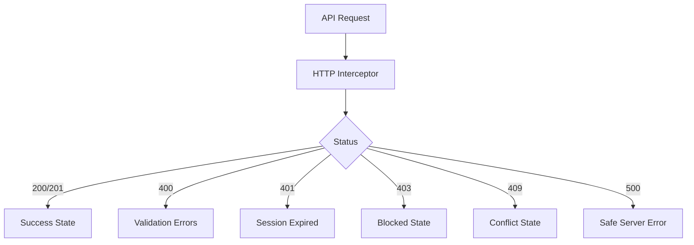
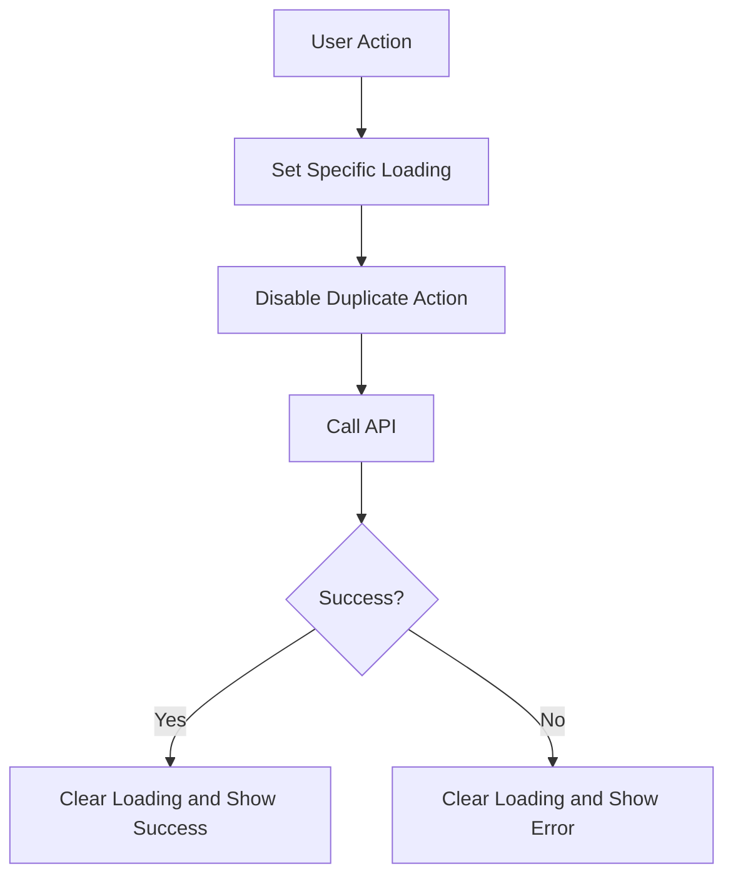

<!-- title: Angular Error Loading Handling -->
<!-- status: Active -->
<!-- system: SCS-TIX EPOS Release 1 -->
<!-- last_updated: 2026-06-08 -->

# Angular Error Loading Handling

## Purpose

This file defines error and loading handling rules for the SCS-TIX Angular
Platform Admin Web Portal.

It applies only to Release 1 Platform Admin Web.

## Core Rule

Error and loading behavior must be consistent across pages, forms, tables,
wizard steps, guards, and API calls.

## Error Handling Layers

| Layer | Responsibility |
|---|---|
| HTTP interceptor | Detect global API errors |
| API service | Return typed success/error response |
| Feature store/service | Map errors to feature state |
| Page component | Show page-level state |
| Shared UI component | Render reusable error/loading views |
| Form component | Render field/form validation |

## Interceptor Responsibilities

Use interceptors for auth token, tenant context on tenant-scoped APIs, 401
handling, 403 handling, safe 500 handling, trace ID, and error normalization.

Interceptors must not hide business errors from feature stores.

## Error Flow

## Status Code Handling

| Status | UI Handling |
|---|---|
| 400 | Field/form validation error |
| 401 | Clear session and redirect to login |
| 403 | Show permission denied or feature not enabled |
| 404 | Show not found inside allowed scope |
| 409 | Show conflict/duplicate/business state message |
| 500 | Show safe server error and retry option |

Do not show raw backend stack traces.

## Validation Error Mapping

Backend validation errors should map to field, form, wizard-step, or page-level
errors.

## Permission and Feature Errors

| Context | UI State |
|---|---|
| Missing permission | Permission denied |
| Missing feature entitlement | Feature not enabled |
| Missing tenant context | Tenant context required |
| Invalid tenant route | Redirect or tenant context error |
| Stale permission | Reload permission context |

Frontend must not assume success after a 403.

## Loading State Types

| Loading Type | Use |
|---|---|
| Global app loading | App bootstrap, auth/session restore |
| Page loading | First page data load |
| Table loading | List refresh, pagination, sorting |
| Button loading | Save, submit, send link, activate |
| Wizard step loading | Step validation/save |
| Export loading | Report export queue/download |
| Guard loading | Permission/tenant/feature check |

Avoid one global spinner for every action.

## Loading State Flow

## Duplicate Submit Rule

While create/update/activate/send-link/export is submitting, disable the action,
prevent duplicate requests, show progress where useful, and restore state.

## Table and Wizard Error Rules

For list pages, keep existing rows during safe refresh, show skeleton on first
load, show retry on failure, preserve filters after retry, and never show stale
tenant data after tenant switch.

Tenant wizard errors must show field errors, step summary, safe backend message,
retry action, and return-to-step path where useful.

## Empty vs Error State

| Situation | State |
|---|---|
| API succeeds with zero rows | Empty state |
| API fails | Error state |
| User lacks permission | Permission denied |
| Tenant feature disabled | Feature not enabled |
| Form invalid | Validation state |

## Security Rules

Do not display stack traces, SQL errors, raw tokens, setup links, provider
secrets, passwords, or POS PIN values.

## Related Files

See [[Angular_App_Architecture]] and [[Angular_API_Integration_Guide]].
- [[Angular_Form_Validation_Guide]]