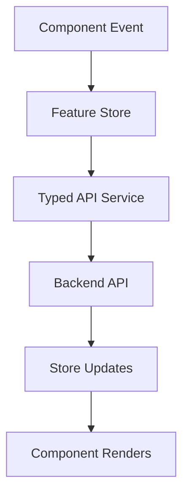

<!-- title: Angular State Management -->
<!-- status: Active -->
<!-- system: SCS-TIX EPOS Release 1 -->
<!-- last_updated: 2026-06-08 -->


# Angular State Management

## Purpose

This file defines state management rules for the SCS-TIX Angular Platform Admin
Web Portal.

It applies only to the Release 1 Platform Admin Web application.

## State Decision

Use feature-level state.

Do not create one global mega store.

Use Angular Signals, Signal Store, or feature services where useful, but keep
ownership clear and tenant-safe.

## State Ownership

| State Type | Owner |
|---|---|
| Auth session/current user | `core/services` |
| Selected tenant context | `core/services` or `core/store` |
| Permission/entitlement context | `core/services` |
| Tenant wizard/list state | `features/admin/store` |
| Products | `features/products/store` |
| Categories | `features/categories/store` |
| Reports | `features/reports/store` |
| Form submit state | Feature page/store |

## Signal / Signal Store Usage

Use Signals or Signal Store for selected tenant, current user projection,
permission/feature projection, filters, pagination, sorting, loading, error,
selected row/detail, tenant wizard, form submit, sidebar, and action visibility.

Do not use frontend state to bypass backend authority.

## State Flow



## Feature Store Pattern

| Feature | Store Responsibilities |
|---|---|
| Admin | Tenant list, wizard, setup records |
| Products | Filters, list, selected product, submit state |
| Categories | Category list/tree, selected category, form state |
| Reports | Report filters, result state, export state |
| Auth | Login, session, logout state |

## Tenant Context Rule

When selected tenant changes:

- Clear tenant-scoped lists and selected records.
- Clear product/category/report state.
- Clear user/role/outlet/till state.
- Reload tenant entitlements and permitted actions.
- Rebuild sidebar/menu.
- Redirect from invalid tenant route where required.

## Platform vs Tenant State

| Platform State | Tenant State |
|---|---|
| Platform dashboard | Tenant users |
| Tenant list | Tenant roles |
| Subscription plan list | Outlets |
| Platform users | Tills |
| Platform audit list | Products/reports |

A tenant switch must not corrupt platform-only state.

## List State Standard

```text
items, page, pageSize, totalCount, searchTerm, filters, sort, loading, error, selectedId
```

Lists must use backend pagination, filtering, and sorting.

## Form State Standard

```text
initialValue, currentValue, dirty, valid, submitting, submitError, fieldErrors, submitSuccess
```

Backend validation remains authoritative.

## Permission State Rule

Permission and entitlement results may be cached for UI rendering.

They are not editable business data.

Backend APIs still enforce permission, feature entitlement, tenant context, and
access rules.

## Derived State Rule

Use computed/derived signals for sidebar visibility, action visibility, wizard
step completion, submit disabled state, empty state, and export availability.

Derived state should not mutate backend data.

## Reset Rules

Reset state when user logs out, session expires, tenant changes, permissions or
entitlements change, wizard ends, or API returns 401/invalid tenant context.

## Anti-Patterns

Do not store hardcoded tenant/product/report data, API URLs, secrets, tokens,
stale tenant-scoped state, or all feature state in one global store.

Do not let components directly mutate shared state.

## Related Files

See [[Angular_App_Architecture]] and [[Angular_API_Integration_Guide]].
- [[Angular_API_Integration_Guide]]