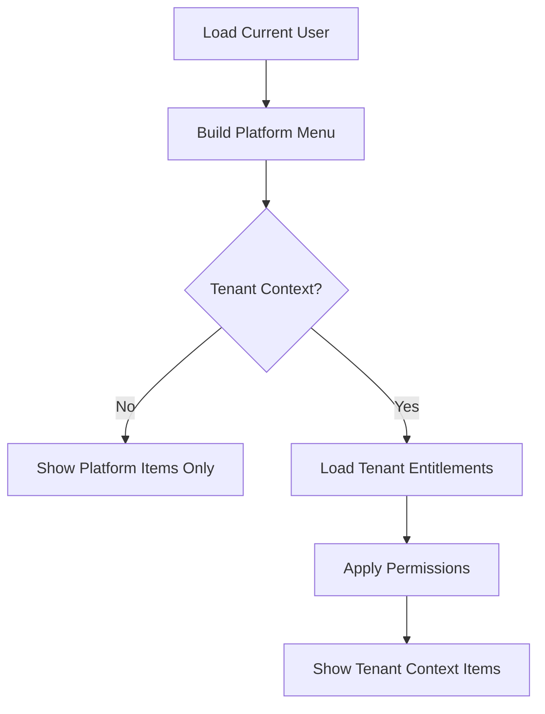

<!-- title: Permission Based Menu -->
<!-- status: Active -->
<!-- system: SCS-TIX EPOS Release 1 -->
<!-- last_updated: 2026-06-08 -->


# Permission Based Menu

## Purpose

This file defines permission and feature-entitlement based menu behavior for the
Angular Platform Admin Web Portal.

Menus must not be fixed role-based.

## Menu Inputs

| Input | Purpose |
|---|---|
| Auth session | Confirms platform admin is logged in |
| Platform permission | Controls platform-level menu/action |
| Selected tenant context | Required for tenant-scoped pages |
| Tenant feature entitlement | Controls tenant feature visibility |
| Feature flag | Controls runtime feature availability |
| Route metadata | Declares required permission/feature/context |

## Menu Decision Flow



## Platform-Level Menu Items

Platform-level menu items may include:

- Dashboard.
- Tenants.
- Subscription Plans.
- Modules and Features.
- Platform Users.
- System Settings.
- Audit Logs.

These routes require platform permissions, not selected tenant context.

## Tenant-Context Menu Items

Tenant-context menu items may include:

- Tenant users.
- Roles and permissions.
- Outlets.
- Tills.
- Products.
- Categories.
- Reports.
- Tenant settings.

Products, categories, and reports also require feature-entitlement guard.

## Menu Configuration Rule

Menu configuration may live in `core/config`.

It must store route metadata, not hardcoded business data.

```text
path: /admin/tenant/:tenantId/products
requiresAuth: true
requiresTenant: true
requiredPermission: product.view
requiredFeature: product_catalog.enabled
```

## Directive Rule

Use reusable directives:

- `hasPermission`.
- `hasFeature`.

Do not repeat permission `if/else` logic in every template.

## Route Guard Rule

Menu hiding is not enough.

Deep links must still be protected by `auth.guard`, `tenant-context.guard`,
`permission.guard`, and `feature-entitlement.guard`.

## Tenant Switch Rule

When selected tenant changes, rebuild tenant menu, clear stale tenant data, reload
entitlements and permissions, and redirect away from invalid tenant routes.

## Related Files

- [[Routing_And_Guards]]
- [[Angular_App_Architecture]]
- [[Reusable_Component_Strategy]]
- [[../02_ACCESS_CONTROL/Feature_Entitlement_Matrix]]
- [[../07_UI_UX_KNOWLEDGE/Permission_Based_UI_Rules]]
