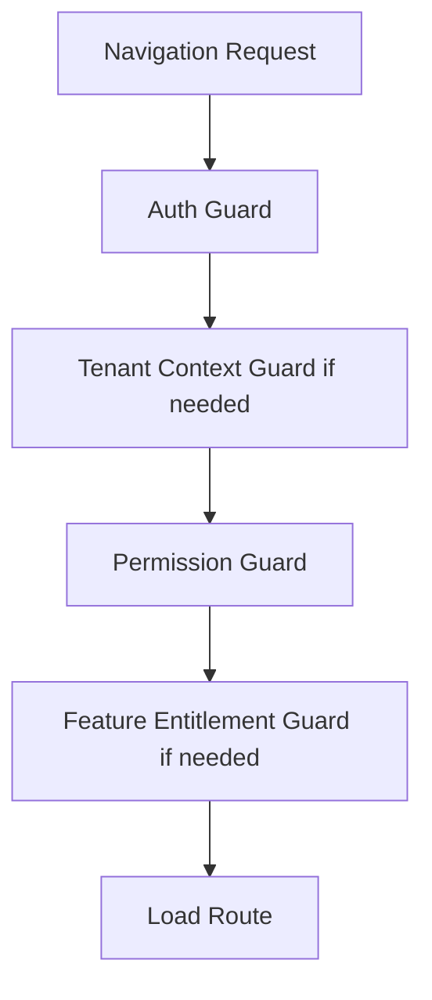

<!-- title: Routing And Guards -->
<!-- status: Active -->
<!-- system: SCS-TIX EPOS Release 1 -->
<!-- last_updated: 2026-06-18 -->

# Routing And Guards

## Purpose

This file defines routing and guard rules for the Angular Platform Admin Web
Portal.

Routes improve UX but backend remains authoritative.

## Route Groups

| Route | Feature | Mode | Guards |
|---|---|---|---|
| `/login` | auth | Public | Guest only |
| `/admin/dashboard` | admin | Platform | auth, permission |
| `/admin/tenants` | admin | Platform | auth, permission |
| `/admin/tenants/create` | admin | Platform | auth, permission |
| `/admin/subscriptions` | admin | Platform | auth, permission |
| `/admin/modules` | admin | Platform | auth, permission |
| `/admin/platform-users` | admin | Platform | auth, permission |
| `/admin/roles-permissions` | admin | Platform | auth, permission (`platform.permissions.view`) |
| `/admin/settings/system` | admin | Platform | auth, permission |
| `/admin/tenant/:tenantId/outlets` | admin | Tenant | auth, tenant-context, permission |
| `/admin/tenant/:tenantId/tills` | admin | Tenant | auth, tenant-context, permission |
| `/admin/tenant/:tenantId/users` | admin | Tenant | auth, tenant-context, permission |
| `/admin/tenant/:tenantId/roles-permissions` | admin | Tenant | auth, tenant-context, permission |
| `/admin/tenant/:tenantId/products` | products | Tenant | auth, tenant-context, permission, feature |
| `/admin/tenant/:tenantId/categories` | categories | Tenant | auth, tenant-context, permission, feature |
| `/admin/tenant/:tenantId/reports` | reports | Tenant | auth, tenant-context, permission, feature |

## Required Guards

| Guard | Purpose |
|---|---|
| `auth.guard` | Blocks unauthenticated routes |
| `permission.guard` | Blocks missing permission |
| `feature-entitlement.guard` | Blocks disabled tenant feature |
| `tenant-context.guard` | Blocks tenant-scoped route without selected tenant |
| Guest guard | Redirects authenticated users away from login |

## Guard Flow

## Tenant Route Rule

Tenant-scoped route must not load if tenant context is missing, stale, or
different from selected tenant.

Tenant switch must clear stale state and rebuild menu/route access.

## Permission Denied Rule

If a route is blocked by permission, show permission-denied screen.

Do not redirect to login for authenticated users lacking permission.

## Feature Disabled Rule

If a route is blocked by feature entitlement, show feature-not-enabled state.

Do not expose disabled feature pages as active Release 1 behavior.

Platform permission catalog at `/admin/roles-permissions` loads from
`GET /api/v1/platform-admin/permission-catalog`. See
[[../02_ACCESS_CONTROL/Backend_Driven_Permission_Catalog]].

## Related Files

- [[Permission_Based_Menu]]
- [[Angular_App_Architecture]]
- [[../02_ACCESS_CONTROL/API_Authorization_Rules]]
- [[../07_UI_UX_KNOWLEDGE/Permission_Based_UI_Rules]]
