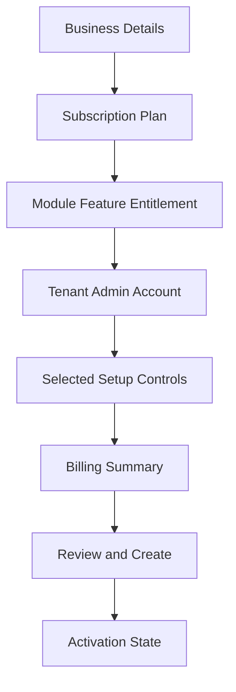

<!-- title: Tenant Wizard State -->
<!-- status: Active -->
<!-- system: SCS-TIX EPOS Release 1 -->
<!-- last_updated: 2026-06-08 -->


# Tenant Wizard State

## Purpose

This file defines Tenant Wizard state handling for the Angular Platform Admin Web
Portal.

The tenant wizard is part of the `features/admin` area.

It must support Platform Admin tenant onboarding within the Release 1 boundary.

## Wizard Scope

The wizard supports:

- Tenant/business creation.
- Subscription plan assignment.
- Module and feature entitlement.
- Tenant admin account setup.
- Selected tenant setup controls.
- Billing summary.
- Payment link state.
- Review and create.
- Tenant activation path.

## Wizard Flow



## Wizard State Object

```text
tenantWizardState
  businessDetails
  tenantAddress
  subscriptionPlan
  selectedFeatures
  tenantAdminAccount
  outletSetup
  tillSetup
  roleUserSetup
  productSetup
  billingSummary
  reviewStatus
```

This is frontend state only.

The backend remains authoritative for validation and persistence.

## Step Responsibility

| Step | Responsibility |
|---|---|
| Business details | Capture tenant name, profile and contact details |
| Subscription | Select plan and billing mode |
| Entitlement | Select modules/features for tenant |
| Tenant admin | Create primary tenant admin account |
| Setup controls | Outlet, till, users/roles, product onboarding where allowed |
| Billing summary | Show invoice/payment-link state |
| Review | Confirm all wizard data |
| Activation | Show ready/pending status |

## State Rules

- Keep wizard state inside `features/admin/store`.
- Do not store tenant wizard state in shared UI components.
- Do not mix platform-level and tenant-level state.
- Clear wizard state after successful create or explicit cancel.
- Persist only through typed admin API services.
- Avoid hardcoded tenant, product, plan, or feature data.

## Validation Rule

Frontend validates required fields and formats.

Backend performs authoritative validation for tenant uniqueness, plan validity,
feature entitlement, tenant admin account, payment link, and activation readiness.

## Tenant Context Rule

Tenant creation steps are platform-level until a tenant record exists.

After creation, selected tenant context is required for tenant-scoped setup pages.

## Related Files

- [[Platform_Admin_Folder_Structure]]
- [[Angular_Form_Validation_Guide]]
- [[Angular_API_Integration_Guide]]
- [[../03_USER_JOURNEYS/Platform_Admin/02_Create_Tenant_Flow]]
- [[../03_USER_JOURNEYS/Platform_Admin/07_Tenant_Activation_Flow]]
