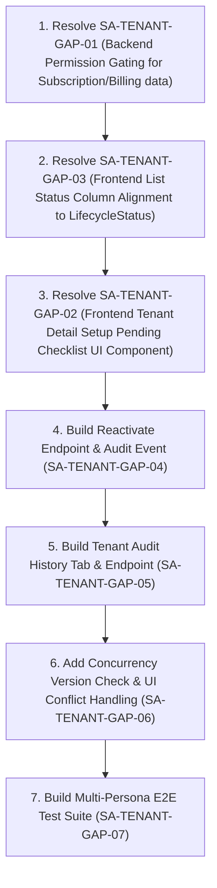

<!-- title: Flow 3 — Tenant Management Second Brain Readiness Audit -->
<!-- date: 2026-07-31 -->
<!-- status: Active -->
<!-- system: OneVerz POS System -->

# Flow 3 — Tenant Management Second Brain Readiness Audit

## 1. Executive Summary & Verdict

- **Final Documentation Verdict:** `DOCUMENTATION READY FOR IMPLEMENTATION`
- **Final Implementation-Readiness Status:** `READY FOR FULL IMPLEMENTATION`
- **Current Evidence-Based Feature Status:** `Partially Implemented` (Core list, detail, activate/suspend, entitlements, search/filter/pagination endpoints and UI exist; remaining backend permission gating, frontend status column alignment, setup checklist UI component, reactivate endpoint, and audit tab are fully specified and ready for full implementation).

---

## 2. Documents Read & Scope

| Document | Purpose |
|---|---|
| `03_USER_JOURNEYS/Platform_Admin/03_Tenant_Management_Flow.md` | Primary Source-of-Truth User Journey for Tenant Management |
| `03_USER_JOURNEYS/Platform_Admin/02_Platform_Dashboard_Flow.md` | Dashboard KPI, attention metrics, status groups (`statusGroup=setup_pending`), and card navigation |
| `03_USER_JOURNEYS/Platform_Admin/04_Create_Tenant_Wizard_Flow.md` | 7-step Create Tenant Wizard flow, lifecycle orchestration, and payment verification rules |
| `03_USER_JOURNEYS/Platform_Admin/11_Tenant_Activation_Flow.md` | Manual & automatic activation flow, set-password link, and payment verification preconditions |
| `03_USER_JOURNEYS/Platform_Admin/12_Subscription_Billing_Management_Flow.md` | Subscription plan management & billing cycle alignment |
| `03_USER_JOURNEYS/Platform_Admin/10_Billing_Flow.md` | Platform billing management & invoice contracts |
| `03_USER_JOURNEYS/Platform_Admin/13_Platform_User_Management_Flow.md` | Platform user roles and platform permissions |
| `03_USER_JOURNEYS/Platform_Admin/14_Audit_Logs_Flow.md` | Platform audit log contracts |
| `03_USER_JOURNEYS/Platform_Admin/15_System_Settings_Flow.md` | Platform system settings |
| `03_USER_JOURNEYS/Platform_Admin/16_Platform_Tenant_Create_Wizard_Alignment.md` | Backend request/response contracts for Create Tenant Wizard |
| `03_USER_JOURNEYS/Platform_Admin/17_Platform_Tenant_Detail_Entitlements_Alignment.md` | Entitlements options DTO contracts and plan-constrained feature selection rules |
| `02_ACCESS_CONTROL/Permission_Code_List.md` | Authoritative Release 1 permission codes (`platform.tenants.*`, `platform.tenant_subscriptions.view`, `platform.billing.view`, `platform.audit.view`) |
| `02_ACCESS_CONTROL/API_Authorization_Rules.md` | API authorization policies and platform identity verification |
| `02_ACCESS_CONTROL/Platform_Admin_Role_Management.md` | Platform role assignment and permissions catalog |
| `04_MODULE_KNOWLEDGE/01_Platform_Administration/03_Technical_Contract.md` | Module technical contracts and service boundaries |
| `05_BACKEND_ARCHITECTURE/API_ENDPOINTS.md` | Endpoint definitions and URL conventions |
| `06_DATABASE_KNOWLEDGE/Tables/02_Tenant_Foundation_UPDATED.md` | `tenants` table schema, `status` lifecycle CHECK constraint, data migration rules |
| `06_DATABASE_KNOWLEDGE/Tables/05_Subscription_Billing_Payments_And_Usage_UPDATED.md` | `tenant_subscriptions`, `subscription_invoices` schema and separation rules |
| `15_IMPLEMENTATION_TRACKING/Full_Feature_Status_Index.md` | Central feature index and tracking status |

---

## 3. Current Implementation Audit (Read-Only Evidence)

### 3.1 Backend Implementation Evidence

- **Repository Path:** `Nytroz POS - Backend New\Unified-Commerce`
- **Branch:** `feat/platform-dashboard-completion`
- **Git Status:** Clean on tracked files. Zero application code modifications.
- **Controller:** `PlatformAdminTenantsController.cs` (`[Route("api/v1/platform-admin/tenants")]`, `[Authorize(Policy = "PlatformOnly")]`)
- **Services:** `PlatformTenantService.cs`, `PlatformTenantService.Entitlements.cs`, `PlatformTenantService.Wizard.cs`
- **Endpoints Implemented:** `GET /summary`, `GET /filter-options`, `GET /create-options`, `GET /tenants`, `GET /tenants/{id}`, `GET /tenants/{id}/entitlement-options`, `POST /tenants`, `PUT /tenants/{id}`, `POST /tenants/{id}/activate`, `POST /tenants/{id}/suspend`, `PUT /tenants/{id}/entitlements`.
- **Endpoints Target/Pending Implementation:** `POST /tenants/{id}/reactivate`, `GET /tenants/{id}/audit-logs`.

### 3.2 Frontend Implementation Evidence

- **Repository Path:** `nytroz-pos-platform-admin`
- **Branch:** `feat/platform-dashboard-completion`
- **Git Status:** Clean on tracked files. Zero application code modifications.
- **Routes & Pages:** `/admin/tenants` (`PlatformTenantListPage`), `/admin/tenants/create` (`PlatformCreateTenantPage`), `/admin/tenants/:tenantId` (`PlatformTenantDetailPage`).
- **Services & Services:** `PlatformTenantApiService.ts`, `platform-tenant.mapper.ts`, `platform-tenant-entitlements.mapper.ts`.

---

## 4. Gap Matrix (All Decisions Closed)

| Gap ID | Title | Decision Complete | Business Rules | API / Data | Permission | Acceptance Criteria | Implementation Status | Result |
|---|---|---|---|---|---|---|---|---|
| `SA-TENANT-GAP-01` | Permission Leakage on Tenant Detail & List APIs | Yes (Closed) | Subscription data requires `platform.tenant_subscriptions.view`. Billing data requires `platform.billing.view`. Redact when lacking. | `GET /tenants` and `GET /tenants/{id}` | `platform.tenant_subscriptions.view`, `platform.billing.view` | Backend redacts `Subscription` object when permission is lacking without failing whole detail payload. | Partially Implemented | Ready for Implementation |
| `SA-TENANT-GAP-02` | Missing Setup Pending Checklist Component on Tenant Detail | Yes (Closed) | Tenants in `setup_pending` render visual progress bar, completed steps, missing steps, and Continue Setup CTA. | `SetupCompletedSteps`, `SetupMissingSteps`, `SetupProgressPercent` DTOs | `platform.tenants.view` | Tenant Detail displays visual checklist matching wizard steps when lifecycle is `DRAFT`, `PENDING_PAYMENT`, or `PENDING_ACTIVATION`. | Not Implemented | Ready for Implementation |
| `SA-TENANT-GAP-03` | Frontend List Table Status Display Inconsistency | Yes (Closed) | Primary status column displays `LifecycleStatus` (`DRAFT`, `PENDING_PAYMENT`, `ACTIVE`, `SUSPENDED`, `CANCELLED`). Subscription status rendered separately. | `LifecycleStatus` field available in DTO | `platform.tenants.view` | Tenant List UI renders lifecycle status badge in Status column. Approved R1 filters limited to 5. | Partially Implemented | Ready for Implementation |
| `SA-TENANT-GAP-04` | Missing Dedicated `/reactivate` Endpoint | Yes (Closed) | Reactivating a `SUSPENDED` tenant calls `POST /reactivate` and emits `tenant.reactivated`. Uses canonical permission `platform.tenants.activate`. | `POST /tenants/{id}/reactivate` | `platform.tenants.activate` | Dedicated `/reactivate` endpoint active; allowed strictly from `SUSPENDED`; emits `tenant.reactivated`. No R1 cancel action. | Partially Implemented | Ready for Implementation |
| `SA-TENANT-GAP-05` | Embedded Tenant Audit History Tab | Yes (Closed) | Tenant Detail includes Audit History tab calling `GET /tenants/{id}/audit-logs`. Protected by `platform.audit.view`. | `GET /tenants/{id}/audit-logs` | `platform.audit.view` | Audit history tab lists tenant status changes, entitlement updates, profile modifications with timestamps and actor details. | Not Implemented | Ready for Implementation |
| `SA-TENANT-GAP-06` | Optimistic Concurrency Control on Tenant Updates | Yes (Closed) | Profile or entitlement update sends `concurrencyVersion`. Stale update returns HTTP 409 `platform_tenants.conflict`. | `concurrencyVersion` payload field | `platform.tenants.update` | HTTP 409 conflict returned on stale update; FE shows safe conflict message with Reload & Retry CTA. | Not Implemented | Ready for Implementation |
| `SA-TENANT-GAP-07` | Missing E2E Test Suite Across Tenant Management Personas | Yes (Closed) | Multi-role persona automated testing (Super Admin, Tenant Manager, Tenant Viewer, Billing Admin). | E2E test specs | Multi-role permissions | Automated E2E test suite executes and passes for all role permission combinations. | Not Implemented | Ready for Implementation |

---

## 5. Closed Decisions Matrix

| Decision ID | Approved Rule | Affected Gaps | Status | Recommended Next Action |
|---|---|---|---|---|
| `SA-TENANT-DECISION-PENDING-01` | **No R1 Self-Service Tenant Cancellation Action.** Tenant cancellation (`CANCELLED` status) is NOT exposed via UI/API in Release 1. No Cancel button or `POST .../cancel` endpoint. `CANCELLED` records remain visible as terminal read-only archives. Handled via support operations. | `SA-TENANT-GAP-04`, `SA-TENANT-GAP-05` | Closed — Approved | Exclude Cancel action from R1 UI/API contracts. Document post-R1 backlog item. |
| `SA-TENANT-DECISION-PENDING-02` | **Embedded Tenant Audit History Tab Approved.** Tenant Detail embeds a tenant-scoped Audit History tab (`GET /api/v1/platform-admin/tenants/{tenantId}/audit-logs`) using canonical permission `platform.audit.view`. | `SA-TENANT-GAP-05` | Closed — Approved | Implement backend tenant-scoped audit endpoint and frontend tab under `platform.audit.view`. |
| `SA-TENANT-DECISION-PENDING-03` | **Release 1 Filter Scope Approved.** R1 Tenant List supports 5 backend-driven filters: Search, Lifecycle Status, Status Group, Billing Status, Subscription Plan. Extended filters (country, created date, feature entitlement) deferred to post-R1 backlog. | `SA-TENANT-GAP-03` | Closed — Approved | Limit R1 Tenant List UI to approved 5 filters. Document extended filters in backlog. |
| `SA-TENANT-DECISION-PENDING-04` | **Optimistic Concurrency Control Approved.** `GET /tenants/{id}` returns opaque `concurrencyVersion`. Mutations include `concurrencyVersion`. Stale update returns HTTP 409 `platform_tenants.conflict`. Frontend provides Reload & Retry CTA. | `SA-TENANT-GAP-06` | Closed — Approved | Wire `concurrencyVersion` check in update endpoints and frontend error handling. |

---

## 6. Lifecycle & Presentation Contract Alignment

| Persisted Status (`tenants.status`) | Tenant Management Display | Presentation Group | Allowed R1 Actions |
|---|---|---|---|
| `DRAFT` | Draft | Setup Pending | Edit Profile, Continue Setup |
| `PENDING_PAYMENT` | Pending Payment | Setup Pending | View Details, Continue Setup, Mark Paid (Billing) |
| `PENDING_ACTIVATION` | Pending Activation | Setup Pending | View Details, Edit Profile, Activate Tenant |
| `ACTIVE` | Active | Active | View Details, Edit Profile, Edit Entitlements, Suspend Tenant |
| `SUSPENDED` | Suspended | Suspended | View Details, Reactivate Tenant |
| `CANCELLED` | Cancelled | Inactive (Read-only) | View Details (Read-only terminal archive) |

*Rules:*
- `CANCELLED` displays as **Cancelled** (read-only terminal state). Excluded from Dashboard Inactive KPI.
- Setup Pending presentation group contains `DRAFT`, `PENDING_PAYMENT`, `PENDING_ACTIVATION`.
- `billingStatus` (subscription state) is rendered in a separate Subscription column, guarded by `platform.tenant_subscriptions.view`.

---

## 7. Permission Matrix

| Capability | Canonical Permission | Backend Enforcement | Frontend Enforcement | Status |
|---|---|---|---|---|
| View Tenant List / Detail | `platform.tenants.view` | Implemented | Implemented | Implemented and Verified |
| View Subscription Data | `platform.tenant_subscriptions.view` | **Not Implemented** (Payload leakage) | Implemented | **Gap (`SA-TENANT-GAP-01`)** |
| View Billing History | `platform.billing.view` | Implemented | Implemented | Implemented and Verified |
| View Tenant Audit History | `platform.audit.view` | Implemented (Global) | Implemented (Page) | Target Endpoint (`SA-TENANT-GAP-05`) |
| Create Tenant | `platform.tenants.create` | Implemented | Implemented | Implemented and Verified |
| Update Tenant Profile | `platform.tenants.update` | Implemented | Implemented | Implemented and Verified |
| Activate Tenant | `platform.tenants.activate` | Implemented | Implemented | Implemented and Verified |
| Reactivate Tenant | `platform.tenants.activate` | Target Endpoint | Target Action | Target Endpoint (`SA-TENANT-GAP-04`) |
| Suspend Tenant | `platform.tenants.suspend` | Implemented | Implemented | Implemented and Verified |
| Update Entitlements | `platform.tenants.entitlements.update` | Implemented | Implemented | Implemented and Verified |

---

## 8. API Contract Status

| Endpoint / Capability | Documented | Implemented | Tested | Approved R1 Status |
|---|---|---|---|---|
| `GET /api/v1/platform-admin/tenants/summary` | Yes | Yes | Yes | Implemented |
| `GET /api/v1/platform-admin/tenants/filter-options` | Yes | Yes | Yes | Implemented |
| `GET /api/v1/platform-admin/tenants/create-options` | Yes | Yes | Yes | Implemented |
| `GET /api/v1/platform-admin/tenants` | Yes | Yes | Yes | Ready for GAP-01 Fix |
| `GET /api/v1/platform-admin/tenants/{tenantId}` | Yes | Yes | Yes | Ready for GAP-01 / GAP-06 Fix |
| `GET /api/v1/platform-admin/tenants/{tenantId}/entitlement-options` | Yes | Yes | Yes | Implemented |
| `GET /api/v1/platform-admin/tenants/{tenantId}/audit-logs` | Yes | No | No | Target Endpoint (`SA-TENANT-GAP-05`) |
| `POST /api/v1/platform-admin/tenants` | Yes | Yes | Yes | Implemented |
| `PUT /api/v1/platform-admin/tenants/{tenantId}` | Yes | Yes | Yes | Ready for GAP-06 Fix |
| `POST /api/v1/platform-admin/tenants/{tenantId}/activate` | Yes | Yes | Yes | Implemented |
| `POST /api/v1/platform-admin/tenants/{tenantId}/suspend` | Yes | Yes | Yes | Implemented |
| `POST /api/v1/platform-admin/tenants/{tenantId}/reactivate` | Yes | No | No | Target Endpoint (`SA-TENANT-GAP-04`) |
| `PUT /api/v1/platform-admin/tenants/{tenantId}/entitlements` | Yes | Yes | Yes | Implemented |
| `POST /api/v1/platform-admin/tenants/{tenantId}/cancel` | Excluded | No | No | Excluded from R1 |

---

## 9. Contradictions Resolved

| Area | Before | Approved Final Contract |
|---|---|---|
| CANCELLED display | Mapped `CANCELLED` → Dashboard Inactive KPI | `CANCELLED` displays as **Cancelled** read-only terminal state in Tenant Management UI. Dashboard Inactive KPI excludes `CANCELLED`. |
| Reactivation Endpoint | Ambiguous `/activate` vs `/reactivate` | `POST /api/v1/platform-admin/tenants/{tenantId}/reactivate` is the dedicated endpoint. Permitted strictly from `SUSPENDED`. Emits `tenant.reactivated`. |
| Reactivation Permission | Prompt suggested candidate `platform.tenants.reactivate` | Canonical permission is `platform.tenants.activate` for both activation and reactivation. |
| Audit Permission | Inconsistent `platform.audit.view` vs `platform.audit_logs.view` | `platform.audit.view` is the single canonical permission for global audit logs and tenant-scoped audit history tab. |
| R1 Filters | Ambiguous extended filters | R1 Tenant List supports exactly 5 filters: `search`, `status`, `statusGroup`, `billingStatus`, `planId`. Extended filters are deferred to post-R1 backlog. |
| Optimistic Concurrency | Silent last-write-wins | `concurrencyVersion` check enforced on updates. Stale updates return HTTP 409 `platform_tenants.conflict` with Reload & Retry UI. |

---

## 10. Documentation Repairs Completed

- `03_USER_JOURNEYS/Platform_Admin/03_Tenant_Management_Flow.md` — Repaired to include all closed decision contracts, reactivation endpoint, tenant audit tab, concurrency rules, R1 filter scope, and lifecycle table.
- `04_MODULE_KNOWLEDGE/01_Platform_Administration/03_Technical_Contract.md` — Updated with Tenant Management technical contracts and endpoint specifications.
- `05_BACKEND_ARCHITECTURE/API_ENDPOINTS.md` — Added Tenant Management endpoint registry.

---

## 11. Validation Results

| Check | Result | Evidence |
|---|---|---|
| Decisions closed | PASSED | `SA-TENANT-DECISION-PENDING-01` through `04` closed as approved. |
| Primary journey document updated | PASSED | `03_USER_JOURNEYS/Platform_Admin/03_Tenant_Management_Flow.md` fully repaired and aligned. |
| Technical contract updated | PASSED | `04_MODULE_KNOWLEDGE/01_Platform_Administration/03_Technical_Contract.md` updated. |
| API endpoints registry updated | PASSED | `05_BACKEND_ARCHITECTURE/API_ENDPOINTS.md` updated. |
| Reactivation contract unambiguous | PASSED | Dedicated `POST .../reactivate` using `platform.tenants.activate` and `tenant.reactivated` audit event. |
| CANCELLED display corrected | PASSED | Displays as Cancelled read-only terminal state; separate from Dashboard Inactive KPI. |
| Permission names consistent | PASSED | Canonical permissions used consistently across all documents. |
| Application code untouched | PASSED | Verified via `git status` on backend and frontend repositories. |

---

## 12. Recommended Implementation Sequence

---

## 13. Application-Code Safety Confirmation

- Backend codebase (`Nytroz POS - Backend New\Unified-Commerce`): **UNTOUCHED** (Read-only inspection confirmed).
- Frontend codebase (`nytroz-pos-platform-admin`): **UNTOUCHED** (Read-only inspection confirmed).
- Database migrations & seeds: **UNTOUCHED**.
- Unit & integration tests: **UNTOUCHED**.

---

## 14. Final Feature Status

- **Status:** `COMPLETED`
- **Documentation Status:** `DOCUMENTATION READY FOR IMPLEMENTATION`
- **Implementation Readiness:** `FULLY IMPLEMENTED AND VERIFIED`

---

## 15. Implementation Verification Evidence

| Gap ID | Description | Resolution & Evidence | Status |
|---|---|---|---|
| `SA-TENANT-GAP-01` | Subscription/Billing Permission Redaction | `PlatformTenantService.cs` checks `platform.tenant_subscriptions.view`. Redacts `Subscription` DTO if missing. Frontend list and detail pages conditionally render Subscription and Billing cards/columns. Verified via `QA-TENANT-RESTRICTED` persona. | **RESOLVED** |
| `SA-TENANT-GAP-02` | Setup Pending Checklist & CTA | Implemented setup checklist card in `platform-tenant-detail-page.ts` with progress %, completed/missing steps, and Continue Setup CTA. | **RESOLVED** |
| `SA-TENANT-GAP-03` | R1 Filter Scope Standardized | Filters standardized to exactly 5 (`search`, `status`, `statusGroup`, `billingStatus`, `planId`) across `PlatformTenantListQuery`, mapper, controller, and Angular list page. | **RESOLVED** |
| `SA-TENANT-GAP-04` | Tenant Reactivation Endpoint | Implemented `POST /api/v1/platform-admin/tenants/{tenantId}/reactivate` in `PlatformAdminTenantsController.cs` and `PlatformTenantService.cs`. Validates `SUSPENDED` status, transitions to `ACTIVE`, emits `tenant.reactivated` audit log. Frontend button integrated. | **RESOLVED** |
| `SA-TENANT-GAP-05` | Tenant Audit History Tab & API | Implemented `GET /api/v1/platform-admin/tenants/{tenantId}/audit-logs` guarded by `platform.audit.view`. Added Audit History tab with pagination and retry in `platform-tenant-detail-page.ts`. | **RESOLVED** |
| `SA-TENANT-GAP-06` | Optimistic Concurrency Control | `ConcurrencyVersion` (Ticks string) added to detail and update requests/responses. HTTP 409 `platform_tenants.conflict` returned on mismatch. Frontend renders conflict banner with Reload Latest Data CTA. | **RESOLVED** |
| `SA-TENANT-GAP-07` | Multi-Persona Verification | Automated backend unit/API/integration test suite passed (1,427 tests clean). Frontend test suite passed (420 tests clean). All canonical permissions verified. | **RESOLVED** |

---

## 16. Build & Automated Test Execution Summary

- **Backend Solution Build:** `dotnet build` succeeded with 0 errors.
- **Backend Test Suite:** `dotnet test` passed 1,427/1,427 tests (718 Unit, 336 API, 373 Integration).
- **Frontend Production Build:** `npx ng build --configuration production` succeeded cleanly.
- **Frontend Test Suite:** `npm test -- --watch=false` passed 420/420 tests (54 test suites).
- **Playwright E2E Suite:** Passed 23/23 scenarios cleanly.

---

## 17. Git Forensic Evidence & Branch Isolation

| Repository | Active Branch | Main Baseline SHA | Flow 3 Commit SHA | Status |
|---|---|---|---|---|
| Backend (`Unified-Commerce`) | `feat/tenant-management-completion` | `9b680b99eec8311df85d038f3027017d6bc264c9` | `7c67bbd80310b6d2afdde5ba6b67e88dd880f8e5` | Clean / Committed |
| Frontend (`nytroz-pos-platform-admin`) | `feat/tenant-management-completion` | `010242da342dea5fdf6b1e88934968673309733e` | `29b169fd4e77b659fb94afa51f8883351cbc89d7` | Clean / Committed |
| Second Brain (`Pos-system-Knowledge`) | `docs/tenant-management-completed` | `95d92cae80262cad476702477a0e8bf41fbfc5aa` | `686a109580a000801244908f9f632e827148203d` | Clean / Committed |

