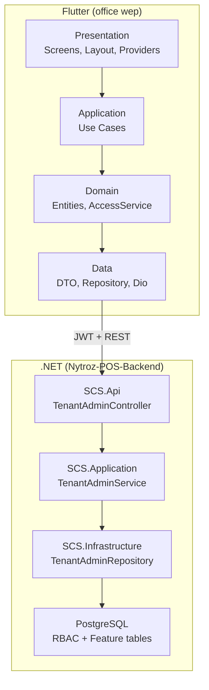
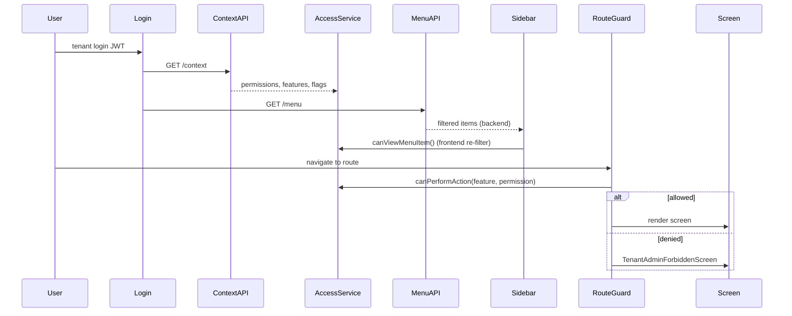

<!-- title: Tenant Admin Full Codebase Report -->
<!-- status: Active -->
<!-- system: SCS-TIX EPOS Release 1 -->
<!-- last_updated: 2026-06-18 -->

# Tenant Admin Full Codebase Report

> Handoff document for developers and AI assistants. Covers backend, frontend, architecture, tests, and maintenance.

## Purpose

This note documents the current Tenant Admin implementation across Flutter frontend and .NET backend. Use it to onboard a new chat session or developer without re-exploring the codebase.

## Project Paths

| Area | Path |
|---|---|
| Flutter Frontend | `c:\Users\User\Desktop\pos final wep\Tenantadmin\Nytroz-POS-App\` |
| .NET Backend | `c:\Users\User\Desktop\pos final wep\Back end\Nytroz-POS-Backend\` |
| Package name | `nytroz_pos` |
| Release status | **Release 1** — navigation, access control, dashboard UI, **outlets CRUD (frontend + backend)** |

## High-Level Architecture



### Backend — Clean Architecture (4 layers)

```text
SCS.Api          → HTTP controllers, JWT auth, ApiResponse envelope
SCS.Application  → TenantAdminService, DTOs, business logic
SCS.Infrastructure → EF repository, seed data, migrations
SCS.Domain       → Authorization code constants only
```

### Frontend — Feature-first Clean Architecture

```text
lib/features/tenant_admin/
├── tenant_admin_router.dart          # GoRouter + guards
├── presentation/   → screens, layout, providers, widgets
├── application/    → use cases (GetContext, GetMenu)
├── domain/         → entities, TenantAdminAccessService
├── data/           → DTOs, mappers, datasources, repository
├── dashboard/      → full submodule (own 4 layers)
└── outlets/        → full submodule (own 4 layers)
```

**Data flow:**

```text
Screen → Riverpod Provider → Use Case → Repository → Remote Datasource (Dio) → DTO → Mapper → Entity
```

## Sidebar Menu — 12 Items (Backend-Driven)

Backend `TenantAdminService.GetMenuAsync()` filters 12 menu definitions. Frontend must not hardcode sidebar visibility.

| # | Menu Key | Route | Feature Code | Permission Code |
|---|---|---|---|---|
| 1 | dashboard | `/tenant-admin/dashboard` | `tenant_admin.dashboard` | `tenant_admin.dashboard.view` |
| 2 | outlets | `/tenant-admin/outlets` | `tenant_admin.outlets` | `tenant_admin.outlets.view` |
| 3 | tills | `/tenant-admin/tills` | `tenant_admin.tills` | `tenant_admin.tills.view` |
| 4 | staff | `/tenant-admin/staff` | `tenant_admin.staff` | `tenant_admin.staff.view` |
| 5 | roles | `/tenant-admin/roles` | `tenant_admin.roles` | `tenant_admin.roles.view` |
| 6 | products | `/tenant-admin/products` | `tenant_admin.products` | `tenant_admin.products.view` |
| 7 | stock | `/tenant-admin/stock` | `tenant_admin.stock` | `tenant_admin.stock.view` |
| 8 | reports | `/tenant-admin/reports` | `tenant_admin.reports` | `tenant_admin.reports.view` |
| 9 | billing | `/tenant-admin/billing` | `tenant_admin.billing` | `tenant_admin.billing.view` |
| 10 | settings | `/tenant-admin/settings` | `tenant_admin.settings` | `tenant_admin.settings.view` |
| 11 | activity | `/tenant-admin/activity` | `tenant_admin.activity` | `tenant_admin.activity.view` |
| 12 | help | `/tenant-admin/help` | `tenant_admin.help` | `tenant_admin.help.view` |

**Menu filter chain (backend + frontend):**

1. User has permission (`tenant_admin.*.view`)
2. Tenant has feature entitlement (`tenant_admin.*`)
3. Runtime flag enabled (`feature_flags` table)

## Backend Implementation

### Dedicated Files (11 source files)

| File | Purpose |
|---|---|
| `SCS.Api/Modules/TenantAdmin/TenantAdminController.cs` | 3 GET endpoints |
| `SCS.Application/Modules/TenantAdmin/Services/TenantAdminService.cs` | Context, menu, dashboard logic |
| `SCS.Application/Modules/TenantAdmin/Services/ITenantAdminService.cs` | Interface |
| `SCS.Application/Modules/TenantAdmin/Services/TenantAdminDevelopmentAccessFallback.cs` | Dev fallback when seed missing |
| `SCS.Application/Modules/TenantAdmin/Interfaces/ITenantAdminRepository.cs` | Repository interface |
| `SCS.Application/Modules/TenantAdmin/DTOs/*.cs` | Context, Menu, Dashboard DTOs |
| `SCS.Domain/Modules/TenantAdmin/AuthorizationCodes/TenantAdminAuthorizationCodes.cs` | 12 features + 17 permissions |
| `SCS.Infrastructure/Modules/TenantAdmin/TenantAdminRepository.cs` | DB queries |
| `SCS.Infrastructure/Persistence/Seed/DevelopmentTenantAdminSeedData.cs` | Dev SQL seed |

### API Endpoints

**Base:** `http://localhost:5052/api/v1/tenant-admin`  
**Auth:** JWT Bearer (tenant login via `POST /api/v1/auth/tenant-login`)

| Method | Route | Permission Gate | Status |
|---|---|---|---|
| GET | `/context` | `tenant.context.view` | Real |
| GET | `/dashboard/summary` | `dashboard.summary.view` | Real |
| GET | `/outlets/summary` | `outlet.summary.view` | Real |
| GET | `/outlets` | `outlet.view` | Real (paginated) |
| POST | `/outlets` | `outlet.create` + `outlet_management` feature | Real |
| GET | `/outlets/{id}` | `outlet.detail.view` | Real |
| PUT | `/outlets/{id}` | `outlet.update` | Real |
| PATCH | `/outlets/{id}/status` | `outlet.status.update` | Real |
| DELETE | `/outlets/{id}` | `outlet.delete` | Real |

**Outlet create:** duplicate code → 409; audit log `OUTLET_CREATED`; tenant ID from JWT only.

See [[../../Backend/Tenant/Outlet_Create_Implementation_Status]].

### Database Tables Used

No Tenant Admin-specific tables. Uses shared RBAC tables:

| Table | Usage |
|---|---|
| `users` | User + `is_tenant_admin` flag |
| `tenants` | Tenant metadata |
| `outlets` | Outlet access list |
| `roles`, `role_permissions`, `permissions` | RBAC |
| `tenant_user_roles`, `outlet_user_roles` | Role assignments |
| `platform_features`, `tenant_feature_entitlements` | Feature entitlements |
| `feature_flags` | Runtime flags |

### Dev Seed Users

| Email | Role | Sidebar Access |
|---|---|---|
| `tenantadmin001@gmail.com` | `tenant_admin_dev` | All 12 items |
| `manager001@gmail.com` | `tenant_admin_manager_dev` | 6 items (dashboard, outlets, tills, staff, stock, reports) |
| `cashier001@gmail.com` | POS only | No tenant admin sidebar |

**Migration:** `20260615120000_SeedDevelopmentTenantAdminData.cs` (Development environment only)

### Backend — Not Yet Built

| Module | Backend API | Status |
|---|---|---|
| Tills, Staff, Roles, Products, Stock, Reports, Billing, Settings, Activity, Help | — | Not implemented |
| Dashboard analytics | Real sales/inventory data | Mock only |

### Dev Scripts

```powershell
cd "C:\Users\User\Desktop\office\Back end\Nytroz-POS-Backend\src\SCS.Api"
.\restart-dev.ps1   # Kill port 5051, build, run
.\stop-dev.ps1      # Stop only
```

**MSB3027 error** = backend already running on port 5051. Run `stop-dev.ps1` first.

## Frontend Implementation

### Folder Structure (~89 files)

```text
lib/features/tenant_admin/
├── tenant_admin_router.dart
├── application/usecases/          # GetTenantAdminContext, GetTenantAdminMenu
├── domain/                          # entities, TenantAdminAccessService
├── data/                            # DTOs, mappers, datasources, repository
├── presentation/
│   ├── layout/                      # sidebar, header, bottom nav, shell
│   ├── providers/                   # context, menu, access providers
│   ├── routing/                     # tenant_admin_route_definition.dart
│   ├── screens/                     # loading, error, forbidden, placeholder
│   ├── theme/                       # colors, spacing, breakpoints
│   └── widgets/                     # shared UI kit
├── dashboard/                       # FULL submodule
└── outlets/                         # FULL submodule
```

### Screens Status

#### Fully Implemented

| Route | Screen |
|---|---|
| `/tenant-admin/dashboard` | `TenantDashboardScreen` |
| `/tenant-admin/outlets` | `OutletListScreen` |
| `/tenant-admin/outlets/add` | `AddOutletScreen` |
| `/tenant-admin/outlets/:id` | `OutletDetailsScreen` |
| `/tenant-admin/outlets/:id/edit` | `EditOutletScreen` |

#### Infrastructure Screens

| Screen | When |
|---|---|
| `TenantAdminLoadingScreen` | Access service loading |
| `TenantAdminErrorScreen` | API/context failure |
| `TenantAdminForbiddenScreen` | Access Denied |
| `TenantAdminPlaceholderScreen` | Unimplemented modules |

#### Placeholder Only

Tills, Staff, Roles, Products, Stock, Reports, Billing, Settings, Activity, Help — **33 routes** placeholder, **5 routes** real screens.

**Total route definitions:** 38 in `tenant_admin_route_definition.dart`

### Layout Components

| Component | File | Behavior |
|---|---|---|
| Shell | `tenant_admin_layout.dart` | ≥900px = sidebar + header; <900px = header + bottom nav |
| Sidebar | `tenant_admin_sidebar.dart` | Backend menu, SCS-TIX branding |
| Header | `tenant_admin_header.dart` | Notifications, user profile |
| Bottom Nav | `tenant_admin_bottom_nav.dart` | First 4 menu items + "More" sheet |

### Key Riverpod Providers

**Shared:**
- `tenantAdminContextProvider`
- `tenantAdminAccessServiceProvider`
- `tenantAdminMenuProvider`

**Dashboard:** `tenantDashboardProvider`

**Outlets:** `outletListProvider`, `outletDetailsProvider`, `createOutletProvider`, `updateOutletProvider`

### API Integration

**v1 endpoints (real backend):**

```text
GET /api/v1/tenant-admin/context
GET /api/v1/tenant-admin/menu
GET /api/v1/tenant-admin/dashboard
```

**Outlets (real v1 backend):**

```text
GET/POST/PUT/PATCH/DELETE /api/v1/tenant-admin/outlets/*
```

**Other legacy/dev paths:**

```text
GET /api/tenant-admin/staff/managers
```

**Dev mock:** `lib/flavors/development/tenant_admin_dev_api_interceptor.dart`

- Enabled in `kDebugMode`
- Mocks context, menu, dashboard, outlets CRUD
- Pass-through real login for `tenantadmin001@gmail.com`
- Demo mock only for `admin@coffeecorner.test`

**API URL (`main.dart`):**
- Chrome/Windows: `http://127.0.0.1:5052`
- Android emulator: `http://10.0.2.2:5052`
- Override: `--dart-define=API_BASE_URL=...`

## Access Control Flow



### Key Files

| Layer | File |
|---|---|
| Permission codes | `lib/core/access/tenant_admin_access_codes.dart` |
| Access logic | `lib/features/tenant_admin/domain/services/tenant_admin_access_service.dart` |
| Route guard | `lib/features/tenant_admin/tenant_admin_router.dart` |
| Widget gate | `lib/features/tenant_admin/presentation/widgets/tenant_permission_gate.dart` |
| Route definitions | `lib/features/tenant_admin/presentation/routing/tenant_admin_route_definition.dart` |

### Access Check Chain

1. `hasTenantContext`
2. `hasFeatureEntitlement(featureCode)`
3. `hasRuntimeFlag(featureCode)`
4. `hasPermission(permissionCode)`
5. Optional `hasOutletAccess(outletId)`

## Test Files

See full inventory: [[Tenant_Admin_Test_Cases]]

### Frontend (`test/features/tenant_admin/` — 30 tests)

| File | Tests | Coverage |
|---|---:|---|
| `outlet_dto_test.dart` | 2 | DTO parsing + create request mapping |
| `tenant_dashboard_summary_dto_test.dart` | 2 | Dashboard summary DTO |
| `outlet_api_errors_test.dart` | 3 | Backend validation → form errors |
| `outlet_list_filters_test.dart` | 4 | Status filter logic + API mapping |
| `outlet_list_visibility_test.dart` | 11 | Permission-based list UI rules |
| `outlet_list_screen_test.dart` | 7 | Outlet list + bottom nav widgets |
| `outlet_details_screen_test.dart` | 2 | Details screen + sales tab gate |

**Missing:** add/edit outlet form widgets, dashboard screen, router guards

### Backend — Tenant Admin (48 tests)

| Project | File | Tests |
|---|---|---:|
| Unit | `TenantAdminOutletServiceTests.cs` | 12 |
| Unit | `TenantAdminOutletPermissionFilterTests.cs` | 6 |
| Unit | `TenantAdminContextServiceTests.cs` | 4 |
| Unit | `DashboardSummaryServiceTests.cs` | 6 |
| Unit | `TenantAdminPermissionSeedTests.cs` | 7 |
| API | `TenantAdminOutletsControllerTests.cs` | 5 |
| API | `TenantAdminContextControllerTests.cs` | 4 |
| API | `TenantAdminDashboardSummaryControllerTests.cs` | 4 |

**Last verified:** 2026-06-18 — 35 unit + 13 API + 30 Flutter = **78 passed**

## Code Structure Maintenance Guide

### Adding a New Module (e.g. Tills, Staff)

**Backend steps:**
1. Add codes in `TenantAdminAuthorizationCodes.cs`
2. Add seed in `DevelopmentTenantAdminSeedData.cs`
3. Add menu item in `TenantAdminService.cs` (if not already in 12 items)
4. Add CRUD controller/endpoints

**Frontend steps:**
1. Create submodule folder:

```text
lib/features/tenant_admin/tills/
├── application/usecases/
├── domain/{entities, repositories}/
├── data/{datasources, models, mappers, repositories}/
└── presentation/{providers, screens, widgets}/
```

2. Register routes in `tenant_admin_route_definition.dart`
3. Map screen in `tenant_admin_router.dart` → `_screenFor()`
4. Add codes in `tenant_admin_access_codes.dart`
5. Wire providers: datasource → repository → use case → FutureProvider
6. Use `TenantAdminAccessService` — never hardcode partial permission strings

### Naming Conventions

| Area | Convention |
|---|---|
| Shared files | `tenant_admin_*` prefix |
| Submodule files | domain prefix (`outlet_*`, `tenant_dashboard_*`) |
| Backend codes | `tenant_admin.{module}` / `tenant_admin.{module}.view` |
| API paths (new) | `/api/v1/tenant-admin/...` |
| Providers | Hand-written Riverpod (no code generation) |

### Rules (Must Follow)

1. Backend authority — menu, permissions, features come from API
2. Screens must not call Dio directly
3. Sidebar must not be hardcoded — use `tenantAdminMenuProvider`
4. Route guards must not be skipped
5. Dev mock must not block real users like `tenantadmin001@gmail.com`

## Dashboard UI vs Design Mockup

| Design Element | Status |
|---|---|
| SCS-TIX sidebar branding | Done |
| 4 KPI cards | Done |
| Sales chart | Bar chart (mockup shows line chart) |
| Needs Attention panel | Done |
| Quick Actions | Done |
| Recent Activity | Done |
| White header + user profile | Done |
| Tenant footer card | Done |
| Date/outlet filters | UI only, not wired to API |
| Mobile bottom nav | Done |

## Known Issues / TODOs

| Issue | Fix |
|---|---|
| Access Denied after login | Apply seed migration + correct permission codes + invalidate providers on login |
| Outlet create/update buttons hidden | Use `TenantAdminPermissionCodes.*` instead of `'outlets.create'` |
| Backend DLL lock MSB3027 | Run `stop-dev.ps1` before rebuild |
| Dev password not documented | Check `DevelopmentAuthSeedData.cs` hash |
| `TenantAdminDevelopmentAccessFallback` | Remove once seed confirmed everywhere |
| Outlets API path mismatch | Resolved — frontend uses `/api/v1/tenant-admin/outlets` |
| 33 placeholder routes | Build submodules one by one following `outlets/` pattern |

## How to Run

```powershell
# Terminal 1 — Backend
cd "C:\Users\User\Desktop\office\Back end\Nytroz-POS-Backend\src\SCS.Api"
.\restart-dev.ps1

# Terminal 2 — Flutter
cd "C:\Users\User\Desktop\office\office wep"
flutter run -d chrome
```

**Login:**
- Tenant Code: `TENANT001`
- Email: `tenantadmin001@gmail.com`
- Password: `123456` (see `DevelopmentAuthSeedData.cs`)

**Verify:**
1. Login success → `/tenant-admin/dashboard`
2. Sidebar 12 items visible
3. `GET /api/v1/tenant-admin/context` → 200
4. `GET /api/v1/tenant-admin/menu` → 200 with 12 items

**Run tests:**

```powershell
# Backend — Tenant Admin
Set-Location "c:\Users\User\Desktop\pos final wep\Back end\Nytroz-POS-Backend"
dotnet test tests/SCS.UnitTests/SCS.UnitTests.csproj --filter "FullyQualifiedName~TenantAdmin"
dotnet test tests/SCS.ApiTests/SCS.ApiTests.csproj --filter "FullyQualifiedName~TenantAdmin"

# Flutter — Tenant Admin
Set-Location "c:\Users\User\Desktop\pos final wep\Tenantadmin\Nytroz-POS-App"
flutter test test/features/tenant_admin/
flutter analyze
```

## Key Files Quick Reference

| Purpose | Path |
|---|---|
| Backend controller | `Back end/.../SCS.Api/Modules/TenantAdmin/TenantAdminController.cs` |
| Backend service | `Back end/.../SCS.Application/Modules/TenantAdmin/Services/TenantAdminService.cs` |
| Backend seed | `Back end/.../SCS.Infrastructure/Persistence/Seed/DevelopmentTenantAdminSeedData.cs` |
| Auth codes (backend) | `Back end/.../SCS.Domain/Modules/TenantAdmin/AuthorizationCodes/TenantAdminAuthorizationCodes.cs` |
| Flutter router | `office wep/lib/features/tenant_admin/tenant_admin_router.dart` |
| Access service | `office wep/lib/features/tenant_admin/domain/services/tenant_admin_access_service.dart` |
| Access codes (frontend) | `office wep/lib/core/access/tenant_admin_access_codes.dart` |
| Sidebar | `office wep/lib/features/tenant_admin/presentation/layout/tenant_admin_sidebar.dart` |
| Dashboard screen | `office wep/lib/features/tenant_admin/dashboard/presentation/screens/tenant_dashboard_screen.dart` |
| Dev mock | `office wep/lib/flavors/development/tenant_admin_dev_api_interceptor.dart` |
| API endpoints | `office wep/lib/core/network/api_endpoints.dart` |
| Access test | `office wep/test/tenant_admin_access_service_test.dart` |

## Summary

Tenant Admin is a **Release 1 admin module** in the Flutter POS app backed by .NET APIs.

- **Backend:** Tenant Admin APIs under `/api/v1/tenant-admin/*` with JWT auth, permission checks, and feature entitlements. Context, dashboard summary, and **outlet CRUD (including create)** are implemented.
- **Frontend:** Clean Architecture with Riverpod — shared layout/sidebar/access + full submodules for `dashboard` and `outlets` (list, create, details, edit).
- **Routes:** 38 registered; 5 real outlet/dashboard screens + 4 infrastructure screens; remaining modules are placeholders.
- **Tests:** 78 automated tests passing (35 backend unit + 13 backend API + 30 Flutter). See [[Tenant_Admin_Test_Cases]].
- **Dev login:** `TENANT001` / `tenantadmin001@gmail.com` / password `123456` on port `5052`.
- **Next work:** Build remaining modules (tills, staff, products) following the `outlets/` pattern.

## Related Files

- [[Flutter_Tenant_Admin_Layout]]
- [[Flutter_App_Architecture]]
- [[Flutter_Permission_Based_UI_Rendering]]
- [[Flutter_Routing_Guards]]
- [[Tenant_Admin_UI_Rules]]
- [[Permission_Code_List]]
- [[Access_Control_Overview]]
- [[Clean_Architecture_Layers]]
- [[Module_Based_Folder_Structure]]
- [[Release_1_Scope]]
- [[Full_Feature_Status_Index]]
